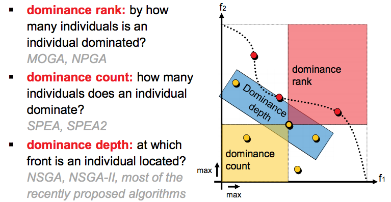
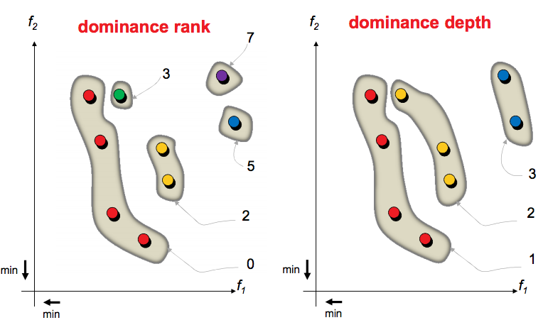
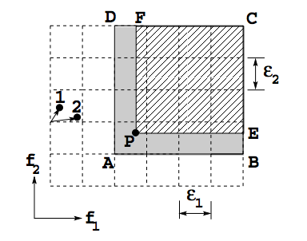
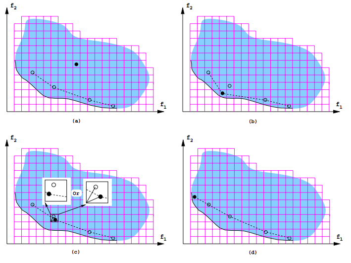

[home](http://tiny.cc/ase2016) |
[copyright](https://github.com/txt/ase16/blob/master/LICENSE.md) &copy;2016, tim&commat;menzies.us
 
 
[overview](https://github.com/txt/ase16/blob/master/doc/overview.md) |
[syllabus](https://github.com/txt/ase16/blob/master/doc/syllabus.md) |
[src](https://github.com/txt/ase16/tree/master/src) |
[submit](http://tiny.cc/ase16give) |
[chat](https://ase16.slack.com/) 

______

# NSGA-II, SPEA2, and Others

Problem: How to find cull many solutions, with multiple objectives

History: 1990s: NSGA, NPGA, MOGA

+ Sort according how often not dominated (nondominating sort)
+ Preserve diversity of solutions.
  + If a crowded part of the space, delete some
  + Elitism (to improve convergence)

All had some high computation times.

## NSGA-II (fast, approximate, non-dominating sort)

K. Deb, A. Pratap, S. Agarwal, and
T. Meyarivan. 2002.
[A fast and elitist multiobjective genetic algorithm: NSGA-II](http://www.iitk.ac.in/kangal/Deb_NSGA-II.pdf). Trans. Evol. Comp
6, 2 (April 2002),
182-197. DOI=http://dx.doi.org/10.1109/4235.996017

Cited by: 15,300+ papers

A standard genetic algorithm (Crossover, mutation) with a state-of-the art selection operator for multi-objectives.

+ Divide candidates into _frontiers_:
+ For some small number:
  + Keep the top i-frontiers until we reach that number
  + If you fill up half way through a frontier,
  + Delete some using crowd-pruning

BUt how do you finds the bands? And what is crowd-pruning?

+ Patience. First, do you get the general idea?
+ Some fast primary ranking method to generate frontier1, frontier2, frontier3...
+ Keep frontier1, frontier2, frontier3... till frontieri gives you too many items
+ Sort frontieri by secondary ranking method, prune the lower ones

Primary rankings: sort by how many things you dominate:

+ Part one: find....
  + _np_: number of candidates that dominate _p_ (the upstream counter)
  + _Sp_: candidates dominated by _p_ (the downstream set)
  + _F1_: frontier 1 (the frontier of things dominated by no one) 
+ Part two...
   + For _P_ in frontier i
     + For everything _Q_ dominated by _P_
        + decrease the upstream counter by 1
     + If upstream counter == 0
           + then _Q_ belongs in frontier i

Secondary ranking (only applied to the "too much"
frontier that cross "over the line").

Find an approximation to the cuboid space around around each
 candidate:

+ For each objective,
   + Sort the candidates on that objective
   + For each candidate _p_ in that "too much" frontier,
      + Find the _gap_ equal to the sum of the space
        _up_ and _down_ to the next candidate
      + Normalize _gap_  by the max-min in that objective.
      + Add _gap_ to _Ip_
+ Sort candidates by _Ip_
  + Discard the smaller ones. 

  

Officially faster. Strange to say, no runtimes in the famous
[NSGA-II paper](http://www.iitk.ac.in/kangal/Deb_NSGA-II.pdf)

BYW, NSGA-II's author has recently released NSGA-II for _many_ objective problems

+ multi: 2,3,4
+ many: 5+

## SPEA2: Improving the Strength Pareto Evolutionary Algorithm

(The following notes come for the excellent website [Clever Algorithms](http://www.cleveralgorithms.com/nature-inspired/evolution/spea.html).)

SPEA2:
[Improving the Strength Pareto Evolutionary Algorithm for Multiobjective Optimization](http://e-collection.library.ethz.ch/eserv/eth:24689/eth-24689-01.pdf)
Eckart Zitzler, Marco Laumanns, Lothar Thiele,
Evolutionary Methods for Design, Optimization and
Control with Applications to Industrial
Problems. Proceedings of the
EUROGEN'2001. Athens. Greece, September 19-21

Cited by 4774.

Again, a genetic algorithm (crossover, mutate) with a novel select operator.

+ Worried about individuals dominated by the same candidate.
+ All individuals scored by the number of other people they dominate.
+ If individuals have identical score, resolve via reflection on local density.

Data structures:

+ _Population_: space of current mutants (build, somewhat, from the _Archive_).
+ _Archive_: a space of good ideas (usually smaller than _Population_; e.g. size/2).

Functions:

+ _CalculateRawFitness()_  number of solutions that a give solution dominate.
+ _CandidateDensity()_ estimates the density of local Pareto front
   +  Euclidean distance of the objective values to  the _K_ nearest neighbors (in objective space)
   + _K_ = sqrt( size(_Archive_) + size(_Population_) ) 
+ _PopulateWithRemainingBest()_  fills in  _Archive_  with remaining candidate solutions in order of fitness.
+ _RemoveMostSimilar()_  truncates _Archive_, removing  members with the smallest difference in their objective scores.
+ _SelectParents_: all pairs comparison, remove dominated ones

Algorithm:

## IBEA

GA + continuous domination.

After mutation, down select as follows:

1. Remove an individual that losses most
2. If pop still too big, goto step 1.

### Works Quite Well

## Epsilon Dominance

Simple. Under-used. Two populations:

- a _population_ of hastily-built, simplistically analyzed candidates
- an _archive_ containing best-in-show.

**Main loop**

0. Build a _population_ at random, then:
1. Using bdom, build an _archive_ from the nondomnated parts of _population_
     -  For _"o"_ objectives, build an _"o"_ dimensional chessboard where the
        objectives are divided into steps of size
        &epsilon; (some domain-specfic "near enough is good enough" number, gathered from the users);
     -  Precompute and cache what cells dominate the other in _dom[i] = [j1,j2,j3..]_;
     -  Mark all archive cells as "undominated".
     -  For all _"c"_ in nondominated( _population_) call _fastdom(c)_.
2. Using two random items _p1,p2_ from _population_
      - select the one _"p"_ that bdom dominates (or, if none, either at random)
3. Pick a random item _"a"_ from the archive
4. Create a _candidate_ called _"c"_ from _p,a_ (using crossover and mutation)
5. Add _"c"_ to the _population_, removing one item _p3_, selected as follows:
       - Searching in random order, if _"c"_ bdom's "_p3_" from _population_, delete _"p3"_ and goto step6
       - If _"c"_ dominates nothing, delete anything at random
6. Add _"c"_ to archive using _fastdom(c)_.
7. If current solutions good enough, then return _archive_.
8. If evaluation budget exhausted, then return _archive_,
9. Else, got to step2.

**Fastdom(c)**  (fast way to build Pareto frontier in the archive, my name)

Here, the chessboard has cells and cells have only one member.

Case (a): ff "_c_" goes into a "dominated" cell then delete "_c_"

Case (b,d): if "_c_" goes into an unoccupoed "undominated" _cell[i]_, follow the _dom[i]_  links.

- for all _j &epsilon; dom[i]_
- if _cell[j]_ is "undominated"
- then mark it "dominated" and recurse on  _dom[j]_.

Case (c): if "_c_" goes into an occupied cell, then delete either _"c"_ or the occupant as follows:

- delete  "_c_" f dominated by the occupant (using bdom);
- else delete occupant if "_c"_ dominated occupant (using bdom)
- else delete the one furthest  from "heaven" (Euclidean distance to Utopian point)

## MOEA/D

Serious cool.

See [MOEA/D](https://docs.google.com/presentation/d/1f8CDrMFDKhkeKYoXiIenqwDKNUvEULrwfLEYZA-nHH0/edit)
     
