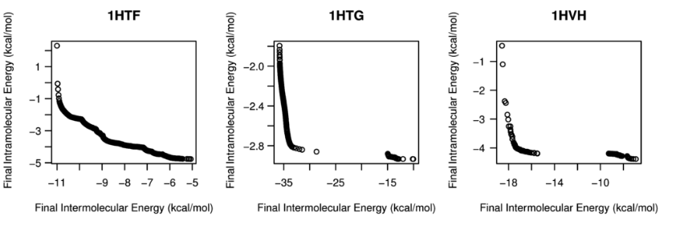
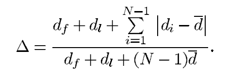
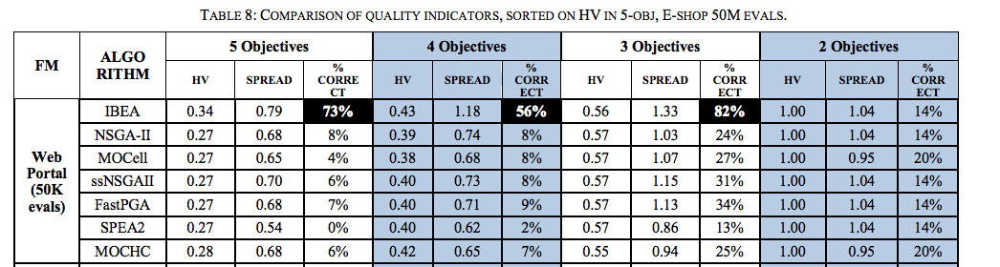

[home](http://tiny.cc/ase2016) |
[copyright](https://github.com/txt/ase16/blob/master/LICENSE.md) &copy;2016, tim&commat;menzies.us
<br>
[](http://tiny.cc/ase2016)<br>
[overview](https://github.com/txt/ase16/blob/master/doc/overview.md) |
[syllabus](https://github.com/txt/ase16/blob/master/doc/syllabus.md) |
[src](https://github.com/txt/ase16/tree/master/src) |
[submit](http://tiny.cc/ase16give) |
[chat](https://ase16.slack.com/) 

_______


# Starter exercise:

1. Download [stats.txt](https://github.com/txt/ase16/blob/master/src/stats.txt)
2. Dowbload [stats.py](https://github.com/txt/ase16/blob/master/src/stats.py)

# Theory

Sooner or later, you are going to ask "is GA/DE/PSO better than GA/DE/PSO" etc.
The answer will be _model dependent_ so, for each new model you
look at, you are going to have to do some kind of analysis.

How?

Well, first you need:

- Models to act as case studies;
- Optimizers, to be compared;
- A _performance measure_ collected on running an optimizer on a model.
- Some way to _compare_ measures. Note that, to be defensible, this
  comaprison method has to be approved by the international community.
- A rig that runs the models and optimizers multiple times (why?)
  which collects the performance measure.
  - Tools to run all the above.

## Performance Measures

### HyperVolume

In the following 2d optimization space, which optimizer do you like?

- Hint: we want to minimize dollars and maximize Q(W)


The volume inside the paretor frontiers is called the _hypervolume_ and the optimizer
we like has the greatest _hypervolume_ (in this case, the green). Note that there
many hypervolume calculators, some of which has problems when the number of objectives
get very large.

- In [Python](https://github.com/ai-se/Spread-HyperVolume).
- In ["R"](https://github.com/cran/hypervolume)

Note that the _more_ the hypervolume, the _better_.

### Spread

In the following 2d optimization space, which optimizer do you like?

- Hint: we want to minimize all objectives
- The left hand side plot _seems_ to have lower hypervolumes. But is there anything
we do not like about the middle and right-hand-side plots?



The middle and right-hand side solutions are not very _spread_ (huge gaps in the frontier).

Calculating spread: 


- Ignoring everything except the Pareto frontier.
- Find the distances to the last two most distance points to their
  nearest neighbor: _d<sub>f</sub>_ and
  _d<sub>l</sub>_
- Find the distance between all pints and their nearest neighbor _d<sub>i</sub>_ and
  their nearest neighbor
  - Then:
  


- If all data is maximally spread, then all distances _d<sub>i</sub>_ are near mean d
which would make _&Delta;=0_ ish.

Note that _less_ the spread of each point to its neighbor, the _better_.

### IGD

Which is better? Spread or hypervolume? What if they conclude different things?
What if they are insanely slow to calculate? What if there was a better measure?

IGD = inter-generational distance; i.e. how good are you compared to the _best known_?

- Find a _reference set_ (the best possible solutions)
- For each optimizer
      - For each item in its final Pareto frontier
      - Find the nearest item in the reference set


Details:

- Problem1: Optimal reference set may be unobtainable (if the model is very nasty).
      - Solution1: Let every optimizer work on populations of size _"N"_
      - Let the combined Pareto frontier from _"a"_ optimizers, removing duplicates.
      - Down select those _"aN"_ items to the  the best _"N"_ best ones.
	  - Use the resulting space as the reference set
          
- Problem2: How to remove duplicates?
      - Solution2a: exact match on decisions (may not be v.useful for real-valued decisions)
      - Solution2b: from the business users, find the minimum value &epsilon;	that
	    they can control each decision. Declare two decisions _same_ if they are within
	    &epsilon;.
            
- Problem3: How to down select?
      - Solution3: count how many times each item in _"aN"_ dominates something else.
      - Keep just the _"N"_ items with highest domination count.
      
- Problem3a: with _binary domination_, many things may have the highest domination
	    count, especially when dealing with high dimensional objections.
      - Solution 3a1: Delete at random from most crowded
	    parts of the Pareto frontier. Why? Cause in crowded spaces, many decisions give
	    rise to the same objective scores.
	  - Solution 3a2: Don't use _binary domination_. Instead, use _continuous domination_
	    since, usually, cdom rejects one item in the comparison. So in this approach,
	    sort each item by the sum of how much it _losses_ to everyone else. They
		pick the _"N"_ that lose least.
                
- Problem 3a1a: How to compute "crowded"
      - Select all candidates that dominate the most number of other candidates.
      - For that set, sort each candidate separately on each objective.
      - On each objective _O<sub>i</sub>_, compute the distance left and right to
	    its nearest neighbor
	  - Let the cuboid around a candidate _V<sub>x</sub>_
	    be the product  _V<sub>x</sub> = &prod;<sub>i</sub>O<sub>i</sub>_
	  - Sort the candidates descending by _V<sub>x</sub>_.
	  - Return the left-most _"N"_ items in that sort.


```
optimal known?
  yes: use it
  no:
    combine frontiers from all optimizers
    remove duplications
      epsilon known?
        yes: use near match
        no: use exact match
    downSelect to "N" items
      use binary domination
        yes:
          count how often each one dominates another
          select candidates that dominate the most
          selection > "N"
            no: use selection
            yes:
              sort descending by cubiod distance around them
              use first 1.."N"
        no:
          sort each, ascending, from the sum of its losses to all other
          use first "N"
```


### Binary Domination

Candidate one dominates candidate two:

- if at lease one objective score is _better_;
- and none are _worse_.

Note that in the following, each objective knows if it wants to be minimized or maximized.

```python
def more(x,y): return x > y
def less(x,y): return x < y
```

e.g. `objective1.better = more` or `objective2.better = less`  then call the following.


```python
def bdom(x, y, abouts):
  "multi objective"
  x = abouts.objs(x)
  y = abouts.objs(y)
  betters = 0
  for obj in abouts._objs:
    x1,y1 = x[obj.pos], y[obj.pos]
    if obj.better(x1,y1) : betters += 1
    elif x1 != y1: return False # must be worse, go quit
  return betters > 0
```

### Continuous Domination

Binary domination never reports that that one candidate is waaaaaay more
dominated that the other. It only says "true".  Not the most informative!


So that as the number of objectives increase, _bdom_ losses to _cdom_.

<a href="../img/cbdom.png"></a>

What _cdom_ does is that it takes the differences between each objective, then
raises it to a exponential factor (so those differences _SHOUT_ louder). From this we compute the mean _loss_
as
travel from _this_ to _that_
versus _that_ to _this_ (and the one we prefer is the one
that _loss_es least).

Formally, this is a domination test across the Pareto frontier.

- First, we normalize _x,y_ to  0..1
- Then we adjust the direction of the comparison depending on
  whether or not we are _minimizing_ that objective.
- Third, we raise the differences _x - y_ to some exponential (i.e.
  the larger the difference, the louder we shout!)
- Lastly, we return the mean loss over all objectives.


```python
def (i):      # return less for minimize and more for maximize
def norm(i,x): # returns (x - lo) / (hi - lo) where lo and hi
               # are the min,max values for objective i

def better(this, that):
  x  = scores[ id(this) ]
  y  = scores[ id(that) ]
  l1 = loss(x,y)
  l2 = loss(y,x)
  return l1 < l2 # this is better than that if this losses least.

def loss(x, y):
  losses= 0
  n = min(len(x),len(y))
  for i,(x1,y1) in enumerate(zip(x,y)):
    x1 = norm(i,x1) # normalization
    y1 = norm(i,y1) # normalization
    losses += expLoss( i,x1,y1,n )
  return losses / n  # return mean loss

def expLoss(i,x1,y1,n):
  "Exponentially shout out the difference"
  w = -1 if minimizing(i) else 1 # adjust for direction of comparison
  return -1*math.e**( w*(x1 - y1) / n ) # raise the differences to some exponent
```  
		
The test that one optimizer is better than another can be recast as four
checks on the *distribution* of performance scores.

1.  Visualize the data, somehow.
2.  Check if the central tendency of one distribution is *better* than
    the other; e.g. compare their median values.
3.  Check the different between the central tendencies is not some
    *small effect*.
4.  Check if the distributions are *significantly different*;
    
The first step is very important. Stats should always be used as sanity
checks on intuitions gained by other means. So look at the data before
making, possibly bogus, inferences from it. For example, here are some
charts showing the effects on a population as we apply more and more of
some treatment. Note that the mean of the populations remains unchanged,
yet we might still endorse the treatment since it reduces the
uncertainty associated with each population.


Note that 2 and 3 and 4 must be all be true to assert that one thing
generates better numbers than another.  For example, one bogus
conclusion would be to just check median values (step2) and ignore
steps3 and steps4. _BAD IDEA_. Medians can be very misleading unless
you consider the overall distributions (as done in step3 and step4).

(As an aside, note that the above requests a check for _median_,
not _mean_. This is required since, all things considered,
means do not mean much, especially for highly skewed distributions.
For example, Bill Gates and 35 homeless people are in the same room.
Their mean annual income is over a billion dollars each- which is
a number that characterized neither Mr. Gates or the homeless people.

On the other hand, the median income of that population is close to zero-
which is a number that characterizes most of that population. )
In practice, step2,step3,step4 are
listed in increasing order of effort (e.g. the _bootstrap sample_ method
discussed later in this subject is an example of step4, and this
can take a while to compute). So pragmatically, it is useful
to explore the above in the order step1 then step2 then step3 then step4 (and _stopping_
along the way if any part fails). For example, 
one possible bogus inference would be to apply step4 without
the step3 since if the *small effect* test fails, then the third
*significance* test is misleading.

For example, returning to the above distributions, note the large
overlap in the top two curves in those plots. When distributions exhibit
a very large overlap, it is very hard to determine if one is really
different to the other. So large variances can mean that even if the
means are *better*, we cannot really say that the values in one
distribution are usually better than the other.

### Step1: Visualization

Suppose we had two optimizers which in a 10 repeated runs generated
performance from two models:

        1:       def _tile2():
        2:         def show(lst):
        3:            return xtile(lst,lo=0, hi=1,width=25,
        4:                         show= lambda s:" %3.2f" % s)
        5:         print "one", show([0.21, 0.29, 0.28, 0.32, 0.32, 
        6:                            0.28, 0.29, 0.41, 0.42, 0.48])
        7:         print "two", show([0.71, 0.92, 0.80, 0.79, 0.78, 
        8:                            0.9,  0.71, 0.82, 0.79, 0.98])

When faced with new data, always chant the following mantra:

-   *First* visualize it to get some intuitions;
-   *Then* apply some statistics to double check those intuitions.

That is, it is *strong recommended* that, prior doing any statistical
work, an analyst generates a visualization of the data. Percentile
charts a simple way to display very large populations in very little
space. For example, here are our results from *one*, displayed on a
range from 0.00 to 1.00.

      one         * --|            , 0.28,  0.29,  0.32,  0.41,  0.48
      two             |    -- * -- , 0.71,  0.79,  0.80,  0.90,  0.98

In this percentile chart, the 2nd and 3rd percentiles as little dashes
left and right of the median value, shown with a *"\*"*, (learner
*two*'s 3rd percentile is so small that it actually disappears in this
display). The vertical bar *"|"* shows half way between the display's
min and max (in this case, that would be (0.0+1.00)/2= 0.50)

#### Xtile

The advantage of percentile charts is that we can show a lot of data in
very little space. 

For example, here's an example where the _xtile_ Python function
shows 2000 numbers on two lines:

-   Quintiles divide the data into the 10th, 30th, 50th, 70th, 90th
    percentile.
-   Dashes (*"-"*) mark the range (10,30)th and (70,90)th percentiles;
-   White space marks the ranges (30,50)th and (50,70)th percentiles.
Consider two distributions, of 1000 samples each: one shows square root
of a *rand()* and the other shows the square of a *rand()*.

       10:       def _tile() :
       11:         import random
       12:         r = random.random
       13:         def show(lst):
       14:           return xtile(lst,lo=0, hi=1,width=25,
       15:                        show= lambda s:" %3.2f" % s)
       16:         print "one", show([r()*0.5 for x in range(1000)])
       17:         print "two", show([r()2   for x in range(1000)])

In the following quintile charts, we show these distributions:

-   The range is 0 to 1.
-   One line shows the square of 1000 random numbers;
-   The other line shows the square root of 1000 random numbers;

Note the brevity of the display:

     one        -----|    *  ---  , 0.32,  0.55,  0.70,  0.84,  0.95
     two --    *     |--------    , 0.01,  0.10,  0.27,  0.51,  0.85

    
As before, the median value, shown with a *"\*"*; and the point half-way
between min and max (in this case, 0.5) is shown as a vertical bar
*"|"*.

### Step2: Check Medians

The median of a list is the middle item of the sorted values, if the list is of an odd size.
If the list size is even, the median is the two values either side of the middle:

    def median(lst,ordered=False):
      lst = lst if ordered else sorted(lst)
      n   = len(lst)
      p   = n // 2
      if (n % 2):  return lst[p]
      p,q = p-1,p
      q   = max(0,(min(q,n)))
      return (lst[p] + lst[q]) * 0.5

### Step3: Effect size

An _effect size_ test is a sanity check that can be summarizes as follows:
* Don't  sweat the small stuff; 
I.e. ignore small differences between items in the samples.
 My
preferred test for *small effect* has:

-   a simple intuition;
-   which makes no assumptions about (say) Gaussian assumptions;
-   and which has a solid lineage in the literature.

Such a test is [Vargha and Delaney][vd00]'s A12 statistic.
 The statistic was
proposed in Vargha and Delaney's 2000 paper was endorsed in many places
including in [Acruci and Briad][ab11]'s ICSE 2011 paper.
After I describe it to you, you will wonder why anyone would ever want
to use anything else.

- [vd00]: http://jeb.sagepub.com/content/25/2/101.short   "A. Vargha and H. D. Delaney. A critique and improvement of the CL common language effect size statistics of McGraw and Wong. Journal of Educational and Behavioral Statistics, 25(2):101-132, 2000"
- [ab11]: http://goo.gl/4N34gk   "Andrea Arcuri, Lionel C. Briand: A practical guide for using statistical tests to assess randomized algorithms in software  engineering. ICSE 2011: 1-10"

Given a performance measure seen in *m* measures
of *X* and *n* measures of *Y*, the A12 statistics measures the
probability that running algorithm *X* yields higher values than running
another algorithm *Y*. Specifically, it counts how often we seen larger
numbers in *X* than *Y* (and if the same numbers are found in both, we
add a half mark):

      a12= #(X.i > Y.j) / (n*m) + .5#(X.i == Y.j) / (n*m)

According to Vargha and Delaney, a small, medium, large difference
between two populations is:

-   *large* if `a12` is over 71%;
-   *medium* if `a12` is over 64%;
-   *small* if `a12` is 56%, or less.

A naive version of this code is shown here in the _ab12slow_ function. While simple to
code, this _ab12slow_ function runs in polynomial time (since for each item in _lst1_,
it runs over all of _lst2_):
```python
def _ab12():
  def a12slow(lst1,lst2):
    more = same = 0.0
    for x in sorted(lst1):
      for y in sorted(lst2):
        if   x==y : 
          same += 1
        elif x > y : 
          more += 1
    return (more + 0.5*same) / (len(lst1)*len(lst2))
  random.seed(1)
  l1 = [random.random() for x in range(5000)]
  more = [random.random()*2 for x in range(5000)]
  l2 = [random.random()  for x in range(5000)]
  less = [random.random()/2.0 for x in range(5000)]
  for tag, one,two in [("1less",l1,more), 
                       ("1more",more,less),("same",l1,l2)]:
    t1  = msecs(lambda : a12(l1,less))
    t2  = msecs(lambda : a12slow(l1,less))
    print("\n",tag,"\n",t1,a12(one,two))
    print(t2, a12slow(one,two))
```
Note that the test code \__ab12_ shows that our fast and slow method generate the same A12 score, but the
fast way does so thousands of times faster. The following tests show runtimes for lists of 5000 numbers:

      experimemt  msecs(fast)  a12(fast)  msecs(slow)  a12(slow)
      1less          13        0.257      9382           0.257  
      1more          20        0.868      9869           0.868
      same           11        0,502      9937           0.502


# Software for Statistics

- Parametric statistical test is one that makes assumptions about the parameters
  (defining properties) of the population distribution(s) from which one's data
  are drawn;
     - E.g. assuming data falls into a "normal" bell-shape curve
- While a non-parametric test is one that makes no such assumptions.

Parametrics can run faster (since non-parametric methods often require
sorting and sampling raw data).

## Visualization

Before we do stats, lets g
et some visuals going:

[Chirp](https://www.cs.uic.edu/~tdang/file/CHIRP-KDD.pdf)


## Utilities

See [stats.py](https://github.com/dotninjas/dotninjas.github.io/blob/master/ninja/stats.py).


```python
from __future__ import division,print_function
import sys,random, argparse
sys.dont_write_bytecode=True

class o():
  "Anonymous container"
  def __init__(i,**fields) : 
    i.override(fields)
  def override(i,d): i.__dict__.update(d); return i
  def __repr__(i):
    d = i.__dict__
    name = i.__class__.__name__
    return name+'{'+' '.join([':%s %s' % (k,d[k]) 
                     for k in i.show()])+ '}'
  def show(i):
    return [k for k in sorted(i.__dict__.keys()) 
            if not "_" in k]

The=o(cohen=0.3, small=3, epsilon=0.01,
      width=50,lo=0,hi=100,conf=0.01,b=1000,a12=0.56)

parser = argparse.ArgumentParser(
  description="Apply Scott-Knot test to data read from standard input")

p=parser.add_argument

p("--demo",    default=False, action="store_true")
p("--cohen",   type=float, default=0.3,  metavar='N', help="too small if delta less than N*std of the data)")
p("--small",   type=int,   default=3,   metavar="N", help="too small if hold less than N items")
p("--epsilon", type=float, default=0.01, metavar="N", help="a range is too small of its hi - lo < N")
p("--width",   type=int,   default=50,   metavar="N", help="width of quintile display")
p("--conf",    type=float, default=0.01, metavar="N", help="bootstrap tests with confidence 1-n")
p("--a12",     type=float, default=0.56, metavar="N", help="threshold for a12 test: disable,small,med,large=0,0.56,0.64,0.71") 

args = parser.parse_args()
The.cohen = args.cohen
The.small = args.small
The.epsilon = args.epsilon
The.conf = args.conf
The.width = args.width + 0
The.a12  = args.a12 + 0
```

# Analysis of Experimental Data

This page is about the non-parametric statistical tests. It is also a chance for us to discuss a little
statistical theory.

## Before we begin...

Imagine the following example contain objective scores gained from different optimizers
_x1,x2,x3,x4,...etc_. Which results are ranked one, two, three etc...

### Lesson Zero

Some differences are obvious

```python
def rdiv0():
  rdivDemo([
        ["x1",0.34, 0.49, 0.51, 0.6],
        ["x2",6,  7,  8,  9] ])
```

     rank ,         name ,    med   ,  iqr 
     ----------------------------------------------------
       1 ,           x1 ,      51  ,    11 (*              |              ), 0.34,  0.49,  0.51,  0.51,  0.60
       2 ,           x2 ,     800  ,   200 (               |   ----   *-- ), 6.00,  7.00,  8.00,  8.00,  9.00

### Lesson One

Some similarities are obvious...


```python
def rdiv1():
  rdivDemo([
        ["x1",0.1,  0.2,  0.3,  0.4],
        ["x2",0.1,  0.2,  0.3,  0.4],
        ["x3",6,  7,  8,  9] ])
```
        
      rank ,         name ,    med   ,  iqr 
      ----------------------------------------------------
         1 ,           x1 ,      30  ,    20 (*              |              ), 0.10,  0.20,  0.30,  0.30,  0.40
         1 ,           x2 ,      30  ,    20 (*              |              ), 0.10,  0.20,  0.30,  0.30,  0.40
         2 ,           x3 ,     800  ,   200 (               |   ----   *-- ), 6.00,  7.00,  8.00,  8.00,  9.00

### Lesson Two

Many results often clump into less-than-many ranks.


```python
def rdiv2():
  rdivDemo([
        ["x1",0.34, 0.49, 0.51, 0.6],
        ["x2",0.6,  0.7,  0.8,  0.9],
        ["x3",0.15, 0.25, 0.4,  0.35],
        ["x4",0.6,  0.7,  0.8,  0.9],
        ["x5",0.1,  0.2,  0.3,  0.4] ])
```

      rank ,         name ,    med   ,  iqr 
      ----------------------------------------------------
         1 ,           x5 ,      30  ,    20 (---    *---    |              ), 0.10,  0.20,  0.30,  0.30,  0.40
         1 ,           x3 ,      35  ,    15 ( ----    *-    |              ), 0.15,  0.25,  0.35,  0.35,  0.40
         2 ,           x1 ,      51  ,    11 (        ------ *--            ), 0.34,  0.49,  0.51,  0.51,  0.60
         3 ,           x2 ,      80  ,    20 (               |  ----    *-- ), 0.60,  0.70,  0.80,  0.80,  0.90
         3 ,           x4 ,      80  ,    20 (               |  ----    *-- ), 0.60,  0.70,  0.80,  0.80,  0.90

### Lesson Three
   
Some results even clump into one rank (the great null result).

```python
def rdiv3():
  rdivDemo([
      ["x1",101, 100, 99,   101,  99.5],
      ["x2",101, 100, 99,   101, 100],
      ["x3",101, 100, 99.5, 101,  99],
      ["x4",101, 100, 99,   101, 100] ])
```

     rank ,         name ,    med   ,  iqr 
     ----------------------------------------------------
        1 ,           x1 ,    10000  ,   150 (-------       *|              ),99.00, 99.50, 100.00, 101.00, 101.00
        1 ,           x2 ,    10000  ,   100 (--------------*|              ),99.00, 100.00, 100.00, 101.00, 101.00
        1 ,           x3 ,    10000  ,   150 (-------       *|              ),99.00, 99.50, 100.00, 101.00, 101.00
        1 ,           x4 ,    10000  ,   100 (--------------*|              ),99.00, 100.00, 100.00, 101.00, 101.00


#### Lesson Four

Heh? Where's  lesson four?

### Lesson Five

Some things had better clump to one thing (sanity check for the ranker).


```python
def rdiv5():
  rdivDemo([
      ["x1",11,11,11],
      ["x2",11,11,11],
      ["x3",11,11,11]])
```

      rank ,         name ,    med   ,  iqr 
      ----------------------------------------------------
         1 ,           x1 ,    1100  ,     0 (*              |              ),11.00, 11.00, 11.00, 11.00, 11.00
         1 ,           x2 ,    1100  ,     0 (*              |              ),11.00, 11.00, 11.00, 11.00, 11.00
         1 ,           x3 ,    1100  ,     0 (*              |              ),11.00, 11.00, 11.00, 11.00, 11.00

### Lesson Six

Some things had better clump to one thing (sanity check for the ranker).

```python
def rdiv6():
  rdivDemo([
      ["x1",11,11,11],
      ["x2",11,11,11],
      ["x4",32,33,34,35]])
```

     rank ,         name ,    med   ,  iqr 
     ----------------------------------------------------
        1 ,           x1 ,    1100  ,     0 (*              |              ),11.00, 11.00, 11.00, 11.00, 11.00
        1 ,           x2 ,    1100  ,     0 (*              |              ),11.00, 11.00, 11.00, 11.00, 11.00
        2 ,           x4 ,    3400  ,   200 (               |          - * ),32.00, 33.00, 34.00, 34.00, 35.00

### Lesson Seven

All the above scales to succinct summaries of hundreds, thousands, millions of numbers

```python
def rdiv7():
  rdivDemo([
    ["x1"] +  [rand()**0.5 for _ in range(256)],
    ["x2"] +  [rand()**2   for _ in range(256)],
    ["x3"] +  [rand()      for _ in range(256)]
  ])
```

     rank ,         name ,    med   ,  iqr 
     ----------------------------------------------------
        1 ,           x2 ,      25  ,    50 (--     *      -|---------     ), 0.01,  0.09,  0.25,  0.47,  0.86
        2 ,           x3 ,      49  ,    47 (  ------      *|   -------    ), 0.08,  0.29,  0.49,  0.66,  0.89
        3 ,           x1 ,      73  ,    37 (         ------|-    *   ---  ), 0.32,  0.57,  0.73,  0.86,  0.95

## So, How to Rank?

For the most part, we are concerned with very high-level issues that
strike to the heart of the human condition:

-   What does it mean to find controlling principles in the world?
-   How can we find those principles better, faster, cheaper?

But sometimes we have to leave those lofty heights to discuss more
pragmatic issues. Specifically, how to present the results of an
optimizer and, sometimes, how to compare and rank the results from
different optimizers.

Note that there is no best way, and often the way we present results
depends on our goals, the data we are procesing, and the audience we are
trying to reach. So the statistical methods discussed below are more
like first-pass approximations to something you may have to change
extensively, depending on the task at hand.

In any case, in order to have at least one report that that you quickly
generate, then....


## Significance Tests

### Standard Utils

Didn't we do this before?

Misc functions:

```python
rand = random.random
any  = random.choice
seed = random.seed
exp  = lambda n: math.e**n
ln   = lambda n: math.log(n,math.e)
g    = lambda n: round(n,2)

def median(lst,ordered=False):
  if not ordered: lst= sorted(lst)
  n = len(lst)
  p = n//2
  if n % 2: return lst[p]
  q = p - 1
  q = max(0,min(q,n))
  return (lst[p] + lst[q])/2

def msecs(f):
  import time
  t1 = time.time()
  f()
  return (time.time() - t1) * 1000

def pairs(lst):
  "Return all pairs of items i,i+1 from a list."
  last=lst[0]
  for i in lst[1:]:
    yield last,i
    last = i

def xtile(lst,lo=The.lo,hi=The.hi,width=The.width,
             chops=[0.1 ,0.3,0.5,0.7,0.9],
             marks=["-" ," "," ","-"," "],
             bar="|",star="*",show=" %3.0f"):
  """The function _xtile_ takes a list of (possibly)
  unsorted numbers and presents them as a horizontal
  xtile chart (in ascii format). The default is a 
  contracted _quintile_ that shows the 
  10,30,50,70,90 breaks in the data (but this can be 
  changed- see the optional flags of the function).
  """
  def pos(p)   : return ordered[int(len(lst)*p)]
  def place(x) : 
    return int(width*float((x - lo))/(hi - lo+0.00001))
  def pretty(lst) : 
    return ', '.join([show % x for x in lst])
  ordered = sorted(lst)
  lo      = min(lo,ordered[0])
  hi      = max(hi,ordered[-1])
  what    = [pos(p)   for p in chops]
  where   = [place(n) for n in  what]
  out     = [" "] * width
  for one,two in pairs(where):
    for i in range(one,two): 
      out[i] = marks[0]
    marks = marks[1:]
  out[int(width/2)]    = bar
  out[place(pos(0.5))] = star 
  return '('+''.join(out) +  ")," +  pretty(what)

def _tileX() :
  import random
  random.seed(1)
  nums = [random.random()**2 for _ in range(100)]
  print(xtile(nums,lo=0,hi=1.0,width=25,show=" %5.2f"))
  ```
  
### Standard Accumulator for Numbers

Note the _lt_ method: this accumulator can be sorted by median values.
Warning: this accumulator keeps _all_ numbers. Might be better to use
a bounded cache.

```python
class Num:
  "An Accumulator for numbers"
  def __init__(i,name,inits=[]): 
    i.n = i.m2 = i.mu = 0.0
    i.all=[]
    i._median=None
    i.name = name
    i.rank = 0
    for x in inits: i.add(x)
  def s(i)       : return (i.m2/(i.n - 1))**0.5
  def add(i,x):
    i._median=None
    i.n   += 1   
    i.all += [x]
    delta  = x - i.mu
    i.mu  += delta*1.0/i.n
    i.m2  += delta*(x - i.mu)
  def __add__(i,j):
    return Num(i.name + j.name,i.all + j.all)
  def quartiles(i):
    def p(x) : return int(g(xs[x]))
    i.median()
    xs = i.all
    n  = int(len(xs)*0.25)
    return p(n) , p(2*n) , p(3*n)
  def median(i):
    if not i._median:
      i.all = sorted(i.all)
      i._median=median(i.all)
    return i._median
  def __lt__(i,j):
    return i.median() < j.median() 
  def spread(i):
    i.all=sorted(i.all)
    n1=i.n*0.25
    n2=i.n*0.75
    if len(i.all) <= 1:
      return 0
    if len(i.all) == 2:
      return i.all[1] - i.all[0]
    else:
      return i.all[int(n2)] - i.all[int(n1)]
```

### The A12 Effect Size Test 

As above

```python
def a12slow(lst1,lst2):
  "how often is x in lst1 more than y in lst2?"
  more = same = 0.0
  for x in lst1:
    for y in lst2:
      if    x == y : same += 1
      elif  x >  y : more += 1
  x= (more + 0.5*same) / (len(lst1)*len(lst2))
  return x

def a12(lst1,lst2):
  "how often is x in lst1 more than y in lst2?"
  def loop(t,t1,t2): 
    while t1.j < t1.n and t2.j < t2.n:
      h1 = t1.l[t1.j]
      h2 = t2.l[t2.j]
      h3 = t2.l[t2.j+1] if t2.j+1 < t2.n else None 
      if h1>  h2:
        t1.j  += 1; t1.gt += t2.n - t2.j
      elif h1 == h2:
        if h3 and h1 > h3 :
            t1.gt += t2.n - t2.j  - 1
        t1.j  += 1; t1.eq += 1; t2.eq += 1
      else:
        t2,t1  = t1,t2
    return t.gt*1.0, t.eq*1.0
  #--------------------------
  lst1 = sorted(lst1, reverse=True)
  lst2 = sorted(lst2, reverse=True)
  n1   = len(lst1)
  n2   = len(lst2)
  t1   = o(l=lst1,j=0,eq=0,gt=0,n=n1)
  t2   = o(l=lst2,j=0,eq=0,gt=0,n=n2)
  gt,eq= loop(t1, t1, t2)
  return gt/(n1*n2) + eq/2/(n1*n2)  >= The.a12

def _a12():
  def f1(): return a12slow(l1,l2)
  def f2(): return a12(l1,l2)
  for n in [100,200,400,800,1600,3200,6400]:
    l1 = [rand() for _ in xrange(n)]
    l2 = [rand() for _ in xrange(n)]
    t1 = msecs(f1)
    t2 = msecs(f2)
    print(n, g(f1()),g(f2()),int((t1/t2)))
```

     n   a12(fast)       a12(slow)       tfast / tslow
     --- --------------- -------------- --------------
     100  0.53           0.53               4
     200  0.48           0.48               6
     400  0.49           0.49              28
     800  0.5            0.5               26
    1600  0.51           0.51              72
    3200  0.49           0.49             109
    6400  0.5            0.5              244

## Non-Parametric Hypothesis Testing

The following _bootstrap_ method was introduced in
1979 by Bradley Efron at Stanford University. It
was inspired by earlier work on the
jackknife.
Improved estimates of the variance were [developed later][efron01].  
[efron01]: http://goo.gl/14n8Wf "Bradley Efron and R.J. Tibshirani. An Introduction to the Bootstrap (Chapman & Hall/CRC Monographs on Statistics & Applied Probability), 1993"

To check if two populations _(y0,z0)_
are different, many times sample with replacement
from both to generate _(y1,z1), (y2,z2), (y3,z3)_.. etc.

```python
def sampleWithReplacement(lst):
  "returns a list same size as list"
  def any(n)  : return random.uniform(0,n)
  def one(lst): return lst[ int(any(len(lst))) ]
  return [one(lst) for _ in lst]
```

Then, for all those samples,
 check if some *testStatistic* in the original pair
hold for all the other pairs. If it does more than (say) 99%
of the time, then we are 99% confident in that the
populations are the same.

In such a _bootstrap_ hypothesis test, the *some property*
is the difference between the two populations, muted by the
joint standard deviation of the populations.

```python
def testStatistic(y,z): 
    """Checks if two means are different, tempered
     by the sample size of 'y' and 'z'"""
    tmp1 = tmp2 = 0
    for y1 in y.all: tmp1 += (y1 - y.mu)**2 
    for z1 in z.all: tmp2 += (z1 - z.mu)**2
    s1    = (float(tmp1)/(y.n - 1))**0.5
    s2    = (float(tmp2)/(z.n - 1))**0.5
    delta = z.mu - y.mu
    if s1+s2:
      delta =  delta/((s1/y.n + s2/z.n)**0.5)
    return delta
```

The rest is just details:

+ Efron advises
  to make the mean of the populations the same (see
  the _yhat,zhat_ stuff shown below).
+ The class _total_ is a just a quick and dirty accumulation class.
+ For more details see [the Efron text][efron01].  

```python
def bootstrap(y0,z0,conf=The.conf,b=The.b):
  """The bootstrap hypothesis test from
     p220 to 223 of Efron's book 'An
    introduction to the boostrap."""
  class total():
    "quick and dirty data collector"
    def __init__(i,some=[]):
      i.sum = i.n = i.mu = 0 ; i.all=[]
      for one in some: i.put(one)
    def put(i,x):
      i.all.append(x);
      i.sum +=x; i.n += 1; i.mu = float(i.sum)/i.n
    def __add__(i1,i2): return total(i1.all + i2.all)
  y, z   = total(y0), total(z0)
  x      = y + z
  tobs   = testStatistic(y,z)
  yhat   = [y1 - y.mu + x.mu for y1 in y.all]
  zhat   = [z1 - z.mu + x.mu for z1 in z.all]
  bigger = 0.0
  for i in range(b):
    if testStatistic(total(sampleWithReplacement(yhat)),
                     total(sampleWithReplacement(zhat))) > tobs:
      bigger += 1
  return bigger / b < conf
```
#### Examples
```python
def _bootstraped(): 
  def worker(n=1000,
             mu1=10,  sigma1=1,
             mu2=10.2, sigma2=1):
    def g(mu,sigma) : return random.gauss(mu,sigma)
    x = [g(mu1,sigma1) for i in range(n)]
    y = [g(mu2,sigma2) for i in range(n)]
    return n,mu1,sigma1,mu2,sigma2,\
        'different' if bootstrap(x,y) else 'same'
  # very different means, same std
  print(worker(mu1=10, sigma1=10, 
               mu2=100, sigma2=10))
  # similar means and std
  print(worker(mu1= 10.1, sigma1=1, 
               mu2= 10.2, sigma2=1))
  # slightly different means, same std
  print(worker(mu1= 10.1, sigma1= 1, 
               mu2= 10.8, sigma2= 1))
  # different in mu eater by large std
  print(worker(mu1= 10.1, sigma1= 10, 
               mu2= 10.8, sigma2= 1))
```
Output:
```python
#_bootstraped()

(1000, 10, 10, 100, 10, 'different')
(1000, 10.1, 1, 10.2, 1, 'same')
(1000, 10.1, 1, 10.8, 1, 'different')
(1000, 10.1, 10, 10.8, 1, 'same')
```
Warning- the above took 8 seconds to generate since we used 1000 bootstraps.
As to how many bootstraps are enough, that depends on the data. There are
results saying 200 to 400 are enough but, since I am  suspicious man, I run it for 1000.
Which means the runtimes associated with bootstrapping is a significant issue.
To reduce that runtime, I avoid things like an all-pairs comparison of all treatments
(see below: Scott-knott).  Also, BEFORE I do the boostrap, I first run
the effect size test (and only go to bootstrapping in effect size passes:
```python
def different(l1,l2):
  #return bootstrap(l1,l2) and a12(l2,l1)
  return a12(l2,l1) and bootstrap(l1,l2)

```
## Saner Hypothesis Testing
The following code, which you should use verbatim does the following:
+ All treatments are clustered into _ranks_. In practice, dozens
  of treatments end up generating just a handful of ranks.
+ The numbers of calls to the hypothesis tests are minimized:
    + Treatments are sorted by their median value.
    + Treatments are divided into two groups such that the
      expected value of the mean values _after_ the split is minimized;
    + Hypothesis tests are called to test if the two groups are truly difference.
          + All hypothesis tests are non-parametric and include (1) effect size tests
            and (2) tests for statistically significant numbers;
          + Slow bootstraps are executed  if the faster _A12_ tests are passed;
In practice, this means that the hypothesis tests (with confidence of say, 95%)
are called on only a logarithmic number of times. So...
+ With this method, 16 treatments can be studied using less than _&sum;<sub>1,2,4,8,16</sub>log<sub>2</sub>i =15_ hypothesis tests  and confidence _0.99<sup>15</sup>=0.86_.
+ But if did this with the 120 all-pairs comparisons of the 16 treatments, we would have total confidence _0.99<sup>120</sup>=0.30.
For examples on using this code, see _rdivDemo_ (below).
```python
def scottknott(data,cohen=The.cohen,small=The.small,useA12=The.a12 > 0, epsilon=The.epsilon):
  """Recursively split data, maximizing delta of
  the expected value of the mean before and 
  after the splits. 
  Reject splits with under 3 items"""
  all  = reduce(lambda x,y:x+y,data)
  same = lambda l,r: abs(l.median() - r.median()) <= all.s()*cohen
  if useA12:
    same = lambda l, r:   not different(l.all,r.all) 
  big  = lambda    n: n > small
  return rdiv(data,all,minMu,big,same,epsilon)

def rdiv(data,  # a list of class Nums
         all,   # all the data combined into one num
         div,   # function: find the best split
         big,   # function: rejects small splits
         same, # function: rejects similar splits
         epsilon): # small enough to split two parts
  """Looks for ways to split sorted data, 
  Recurses into each split. Assigns a 'rank' number
  to all the leaf splits found in this way. 
  """
  def recurse(parts,all,rank=0):
    "Split, then recurse on each part."
    cut,left,right = maybeIgnore(div(parts,all,big,epsilon),
                                 same,parts)
    if cut: 
      # if cut, rank "right" higher than "left"
      rank = recurse(parts[:cut],left,rank) + 1
      rank = recurse(parts[cut:],right,rank)
    else: 
      # if no cut, then all get same rank
      for part in parts: 
        part.rank = rank
    return rank
  recurse(sorted(data),all)
  return data

def maybeIgnore((cut,left,right), same,parts):
  if cut:
    if same(sum(parts[:cut],Num('upto')),
            sum(parts[cut:],Num('above'))):    
      cut = left = right = None
  return cut,left,right

def minMu(parts,all,big,epsilon):
  """Find a cut in the parts that maximizes
  the expected value of the difference in
  the mean before and after the cut.
  Reject splits that are insignificantly
  different or that generate very small subsets.
  """
  cut,left,right = None,None,None
  before, mu     =  0, all.mu
  for i,l,r in leftRight(parts,epsilon):
    if big(l.n) and big(r.n):
      n   = all.n * 1.0
      now = l.n/n*(mu- l.mu)**2 + r.n/n*(mu- r.mu)**2  
      if now > before:
        before,cut,left,right = now,i,l,r
  return cut,left,right

def leftRight(parts,epsilon=The.epsilon):
  """Iterator. For all items in 'parts',
  return everything to the left and everything
  from here to the end. For reasons of
  efficiency, take a first pass over the data
  to pre-compute and cache right-hand-sides
  """
  rights = {}
  n = j = len(parts) - 1
  while j > 0:
    rights[j] = parts[j]
    if j < n: rights[j] += rights[j+1]
    j -=1
  left = parts[0]
  for i,one in enumerate(parts):
    if i> 0:
      if parts[i]._median - parts[i-1]._median > epsilon:
        yield i,left,rights[i]
      left += one
```
## Putting it All Together
Driver for the demos:
```pythong
def rdivDemo(data):
  def zzz(x):
    return int(100 * (x - lo) / (hi - lo + 0.00001))
  data = map(lambda lst:Num(lst[0],lst[1:]),
             data)
  print("")
  ranks=[]
  for x in scottknott(data,useA12=True):
    ranks += [(x.rank,x.median(),x)]
  all=[]
  for _,__,x in sorted(ranks): all += x.all
  all = sorted(all)
  lo, hi = all[0], all[-1]
  line = "----------------------------------------------------"
  last = None
  print(('%4s , %12s ,    %s   , %4s ' % \
               ('rank', 'name', 'med', 'iqr'))+ "\n"+ line)
  for _,__,x in sorted(ranks):
    q1,q2,q3 = x.quartiles()
    print(('%4s , %12s ,    %4s  ,  %4s ' % \
                 (x.rank+1, x.name, q2, q3 - q1))  + \
              xtile(x.all,lo=lo,hi=hi,width=30,show="%5.2f"))
    last = x.rank 

def _rdivs():
  seed(1)
  rdiv0();  rdiv1(); rdiv2(); rdiv3(); 
  rdiv5(); rdiv6(); print("###"); rdiv7()

def thing(x):
    "Numbers become numbers; every other x is a symbol."
    try: return int(x)
    except ValueError:
        try: return float(x)
        except ValueError:
            return x
          
def main():
  log=None
  all={}
  now=[]
  for line in sys.stdin:
    for word in line.split():
      word = thing(word)
      if isinstance(word,str):
        now = all[word] = all.get(word,[])
      else:
        now += [word]
  rdivDemo( [ [k] + v for k,v in all.items() ] ) 

if args.demo:
  _rdivs()
else:
  main()
```


