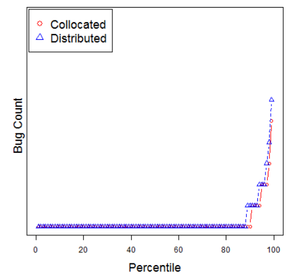
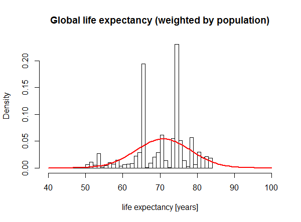
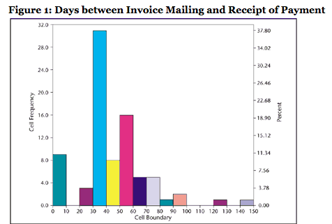
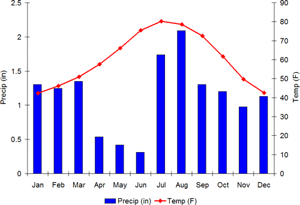
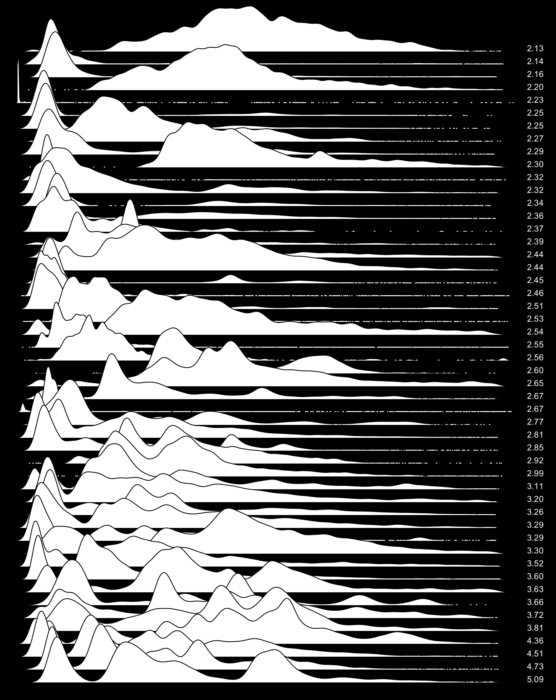
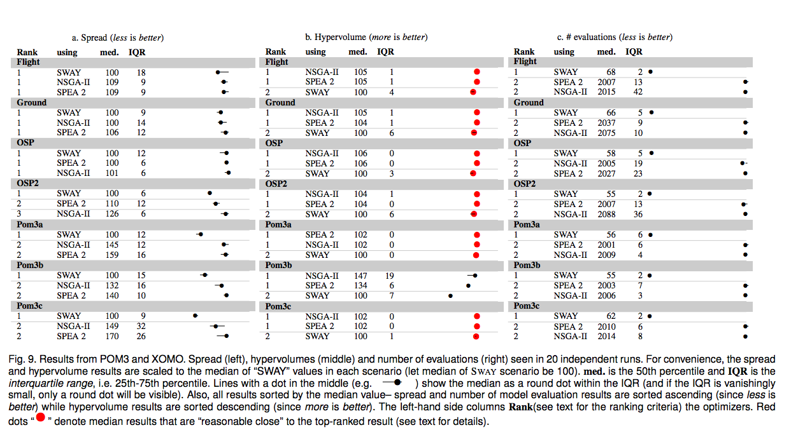
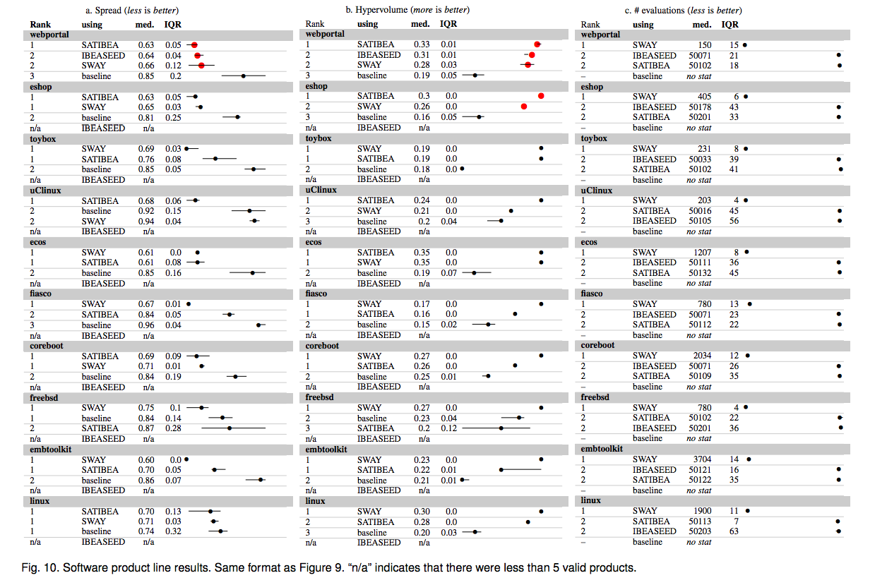

[home](http://tiny.cc/ase2016) |
[copyright](https://github.com/txt/ase16/blob/master/LICENSE.md) &copy;2016, tim&commat;menzies.us
<br>
[](http://tiny.cc/ase2016)<br>
[overview](https://github.com/txt/ase16/blob/master/doc/overview.md) |
[syllabus](https://github.com/txt/ase16/blob/master/doc/syllabus.md) |
[src](https://github.com/txt/ase16/tree/master/src) |
[submit](http://tiny.cc/ase16give) |
[chat](https://ase16.slack.com/) 

_______

# Comparing Treatments

Your task:

1. Download
      - [stats0.txt](https://github.com/txt/ase16/blob/master/src/stats0.txt)
      - [stat2.txt](https://github.com/txt/ase16/blob/master/src/stat2.txt)
      - [stat4.py](https://github.com/txt/ase16/blob/master/src/stat4.py)
      - [stats.py](https://github.com/txt/ase16/blob/master/src/stats.py)
2. Read the following down to (and including the section "Medians").
3. Read the code in `stat4.py`. What is going on there? Run   
   `python stat4.py | python stats.py`  and comment if you
   agree or disagree with the output.
4. Repeat  the following exercise for `stat2.txt`, then `stats0.txt`
       - Look at the data in stats0.txt;
       - Sort them by their median;
       - Draw percentile charts for each (no need to be super accurate, near enough is good enough);
       - Do any of these seven groups cluster together?
       - When you have answers to all the above (and not before), compare your results to   
         `cat statX.txt | python stats.py --text 30`

Note the code `stats.py`. What does it do? How does it generate the `rank`
numbers? Well, to explain all that, we are going need some theory...

# Theory

Sooner or later, you are going to ask "is GA/DE/PSO better than GA/DE/PSO" etc.
The answer will be _model dependent_ so, for each new model you
look at, you are going to have to do some kind of analysis.

How?

Well, first you need:


1. Models to act as case studies;
2. Optimizers, to be compared;
3. A _performance measure_ collected on running an optimizer on a model.
4. Some way to _compare_ measures. Note that, to be defensible, this
  comaprison method has to be approved by the international community.
5. A rig that runs the models and optimizers multiple times (why?)
  which collects the performance measure.
  - Tools to run all the above.

See [perform.md](perform.md) for notes on 1,2,3.

This talk is about  4,5.


## Compare Measures


### Visualize the Data 

To compare  if one optimizer is better than another, apply the followng rules:

1.  Visualize the data, somehow.
2.  Check if the central tendency of one distribution is *better* than
    the other; e.g. compare their median values.
3.  Check the different between the central tendencies is not some
    *small effect*.
4.  Check if the distributions are *significantly different*;

That is:

When faced with new data, always chant the following mantra:

-   *First* visualize it to get some intuitions;
-   *Then* apply some statistics to double check those intuitions.

That is, it is *strong recommended* that, prior doing any statistical
work, an analyst generates a visualization of the data.

Percentile
charts a simple way to display very large populations in very little
space.
Suppose we had two optimizers which in a 10 repeated runs generated
performance from two models:

        1:       def _tile2():
        2:         def show(lst):
        3:            return xtile(lst,lo=0, hi=1,width=25,
        4:                         show= lambda s:" %3.2f" % s)
        5:         print "one", show([0.21, 0.29, 0.28, 0.32, 0.32, 
        6:                            0.28, 0.29, 0.41, 0.42, 0.48])
        7:         print "two", show([0.71, 0.92, 0.80, 0.79, 0.78, 
        8:                            0.9,  0.71, 0.82, 0.79, 0.98])

Here are the percentile charts:

       one         * --|            , 0.28,  0.29,  0.32,  0.41,  0.48
       two             |    -- * -- , 0.71,  0.79,  0.80,  0.90,  0.98

In this percentile chart, the 2nd and 3rd percentiles as little dashes
left and right of the median value, shown with a *"\*"*, (learner
*two*'s 3rd percentile is so small that it actually disappears in this
display). The vertical bar *"|"* shows half way between the display's
min and max (in this case, that would be (0.0+1.00)/2= 0.50)


The advantage of percentile charts is that we can show a lot of data in
very little space. 

For example, here's an example where the _xtile_ Python function
shows 2000 numbers on two lines:

-   Quintiles divide the data into the 10th, 30th, 50th, 70th, 90th
    percentile.
-   Dashes (*"-"*) mark the range (10,30)th and (70,90)th percentiles;
-   White space marks the ranges (30,50)th and (50,70)th percentiles.

Consider two distributions, of 1000 samples each: one shows square root
of a *rand()* and the other shows the square of a *rand()*.

        10:       def _tile() :
        11:         import random
        12:         r = random.random
        13:         def show(lst):
        14:           return xtile(lst,lo=0, hi=1,width=25,
        15:                        show= lambda s:" %3.2f" % s)
        16:         print "one", show([r()*0.5 for x in range(1000)])
        17:         print "two", show([r()*2   for x in range(1000)])

In the following quintile charts, we show these distributions:

-   The range is 0 to 1.
-   One line shows the square of 1000 random numbers;
-   The other line shows the square root of 1000 random numbers;

Note the brevity of the display:

     one        -----|    *  ---  , 0.32,  0.55,  0.70,  0.84,  0.95
     two --    *     |--------    , 0.01,  0.10,  0.27,  0.51,  0.85

    
As before, the median value, shown with a star and
 the point half-way
between min and max (in this case, 0.5) is shown as a vertical bar.

BTW, there are [_many_ more ways to view results](http://www.tableau.com/about/blog/2013/7/list-books-about-data-visualisation-24182) than just percentiles

### Medians

To compare  if one optimizer is better than another, apply the followng rules:

1.  Visualize the data, somehow.
2.  <b>Check if the central tendency of one distribution is *better* than
    the other; e.g. compare their median values.</b>
3.  Check the different between the central tendencies is not some
    *small effect*.
4.  Check if the distributions are *significantly different*;

All things considered,
means do not mean much, especially for highly skewed distributions.
For example:

- Bill Gates and 35 homeless people are in the same room.
- Their mean annual income is over a billion dollars each- which is
  a number that characterized neither Mr. Gates or the homeless people.
- On the other hand, the median income of that population is close to zero-
  which is a number that characterizes most of that population. 


The median of a list is the middle item of the sorted values, if the list is of an odd size.
If the list size is even, the median is the two values either side of the middle:

    def median(lst,ordered=False):
       lst = lst if ordered else sorted(lst)
       n   = len(lst)
       p   = n // 2
       if (n % 2):  return lst[p]
       p,q = p-1,p
       q   = max(0,(min(q,n)))
       return (lst[p] + lst[q]) * 0.5


### Check for "Small Effects"

To compare  if one optimizer is better than another, apply the followng rules:

1.  Visualize the data, somehow.
2.  Check if the central tendency of one distribution is *better* than
    the other; e.g. compare their median values.
3.  <b>Check the different between the central tendencies is not some
    *small effect*.</b>
4.  Check if the distributions are *significantly different*;

An _effect size_ test is a sanity check that can be summarizes as follows:

-  Don't  sweat the small stuff; 

I.e. ignore small differences between items in the samples.

There parametric and non-parametric tests for "small effects" (which, if we find, we should just ignore).

Parametric tests assume that the numbers fit some simple distribution (e.g. the normal Gaussian curve).

#### Cohen's rule:

- compare means _&Delta; = &mu;1-&mu;2_ between two samples;
- compute the standard deviation &sigma; of the combined samples;
- large effect if &Delta; &lt; 0.5*&sigma;
- medium effect if &Delta; &lt; 0.3*&sigma;
- small effect if &Delta; &lt; 0.1*&sigma;; And "small effect" means "yawn", too small to be interesting.

Widely viewed as too simplistic.

#### Hedge's rule (using _g_):

- Still parametric
- Modifies &Delta; w.r.t. the standard deviation of both samples.
- Adds a correction factor _c_ for small sample sizes.
- In their review of use of effect size in SE, Kampenses et al. report that many papers use something like _g &lt; 0.38_
  is the boundary between _small effects_ and bigger effects.
        - [ Systematic Review of Effect Size in
Software Engineering Experiments ](https://pdfs.semanticscholar.org/e6be/263f60ccfb294e14422f0e0162b1367063a2.pdf)
          Kampenes, Vigdis By, et al.  Information and Software Technology 49.11 (2007): 1073-1086.
        - See equations 2,3,4 and Figure 9

```python
def hedges(i,j,small=0.38):
    """
    Hedges effect size test.
    Returns true if the "i" and "j" difference is only a small effect.
    "i" and "j" are   objects reporing mean (i.mu), standard deviation (i.s) 
    and size (i.n) of two  population of numbers.
    """
    num   = (i.n - 1)*i.s**2 + (j.n - 1)*j.s**2
    denom = (i.n - 1) + (j.n - 1)
    sp    = ( num / denom )**0.5
    delta = abs(i.mu - j.mu) / sp  
    c     = 1 - 3.0 / (4*(i.n + j.n - 2) - 1)
    return delta * c < small
```    

#### A12

My
preferred test for *small effect* is

-   a simple intuition;
-   which makes no assumptions about (say) Gaussian assumptions;
-   and which has a solid lineage in the literature.

Such a test is [Vargha and Delaney][vd00]'s A12 statistic.
 The statistic was
proposed in Vargha and Delaney's 2000 paper was endorsed in many places
including in [Acruci and Briad][ab11]'s ICSE 2011 paper.
After I describe it to you, you will wonder why anyone would ever want
to use anything else.

- [vd00]: http://jeb.sagepub.com/content/25/2/101.short   "A. Vargha and H. D. Delaney. A critique and improvement of the CL common language effect size statistics of McGraw and Wong. Journal of Educational and Behavioral Statistics, 25(2):101-132, 2000"
- [ab11]: http://goo.gl/4N34gk   "Andrea Arcuri, Lionel C. Briand: A practical guide for using statistical tests to assess randomized algorithms in software  engineering. ICSE 2011: 1-10"

Given a performance measure seen in *m* measures
of *X* and *n* measures of *Y*, the A12 statistics measures the
probability that running algorithm *X* yields higher values than running
another algorithm *Y*. Specifically, it counts how often we seen larger
numbers in *X* than *Y* (and if the same numbers are found in both, we
add a half mark):

      a12= #(X.i > Y.j) / (n*m) + .5#(X.i == Y.j) / (n*m)

According to Vargha and Delaney, a small, medium, large difference
between two populations is:

-   *large* if `a12` is over 71%;
-   *medium* if `a12` is over 64%;
-   *small* if `a12` is 56%, or less.

A naive version of this code is shown here in the _ab12slow_ function. While simple to
code, this _ab12slow_ function runs in polynomial time (since for each item in _lst1_,
it runs over all of _lst2_):

```python
def a12slow(lst1,lst2,small=0.56):
    more = same = 0.0
    for x in sorted(lst1):
      for y in sorted(lst2):
        if   x==y : 
          same += 1
        elif x > y : 
          more += 1
    return (more + 0.5*same) / (len(lst1)*len(lst2)) < small.
```

Here's a faster version taht sorts the lists first

```python
def a12(lst1,lst2,small=0.56):
  "how often is x in lst1 more than y in lst2?"
  def loop(t,t1,t2): 
    while t1.j < t1.n and t2.j < t2.n:
      h1 = t1.l[t1.j]
      h2 = t2.l[t2.j]
      h3 = t2.l[t2.j+1] if t2.j+1 < t2.n else None 
      if h1>  h2:
        t1.j  += 1; t1.gt += t2.n - t2.j
      elif h1 == h2:
        if h3 and h1 > h3 :
            t1.gt += t2.n - t2.j  - 1
        t1.j  += 1; t1.eq += 1; t2.eq += 1
      else:
        t2,t1  = t1,t2
    return t.gt*1.0, t.eq*1.0
  #--------------------------
  lst1 = sorted(lst1, reverse=True)
  lst2 = sorted(lst2, reverse=True)
  n1   = len(lst1)
  n2   = len(lst2)
  t1   = o(l=lst1,j=0,eq=0,gt=0,n=n1)
  t2   = o(l=lst2,j=0,eq=0,gt=0,n=n2)
  gt,eq= loop(t1, t1, t2)
  return gt/(n1*n2) + eq/2/(n1*n2) < 0.56
```

The above uses a helper class:

```python
class o():
  "Anonymous container"
  def __init__(i,**fields) : 
    i.override(fields)
  def override(i,d): i.__dict__.update(d); return i
  def __repr__(i):
    d = i.__dict__
    name = i.__class__.__name__
    return name+'{'+' '.join([':%s %s' % (k,d[k]) 
                     for k in i.show()])+ '}'
  def show(i):
    return [k for k in sorted(i.__dict__.keys()) 
            if not "_" in k]
```

The following code benchmarks slow and fast a12:

```python
def _ab12():  
  random.seed(1)
  l1 = [random.random() for x in range(5000)]
  more = [random.random()*2 for x in range(5000)]
  l2 = [random.random()  for x in range(5000)]
  less = [random.random()/2.0 for x in range(5000)]
  for tag, one,two in [("1less",l1,more), 
                       ("1more",more,less),("same",l1,l2)]:
    t1  = msecs(lambda : a12(l1,less))
    t2  = msecs(lambda : a12slow(l1,less))
    print("\n",tag,"\n",t1,a12(one,two))
    print(t2, a12slow(one,two))
```

Note that the test code \+_ab12_ shows that our fast and slow method generate
the same A12 score, but the fast way does so thousands of times faster. The
following tests show runtimes for lists of 5000 numbers:

      experimemt  msecs(fast)  a12(fast)  msecs(slow)  a12(slow)
      1less          13        0.257      9382           0.257  
      1more          20        0.868      9869           0.868
      same           11        0,502      9937           0.502

Endorsed in the SE literature:

- Andrea Arcuri and Lionel Briand. 2011. A practical guide for using statistical tests to assess randomized algorithms in software engineering. In Proceedings of the 33rd International Conference on Software Engineering (ICSE '11). ACM, New York, NY, USA, 1-10. DOI=http://dx.doi.org/10.1145/1985793.1985795

#### Cliff's Delta

Is non-parametric, like A12. Not yet endorsed in the SE literature.
But it should be!

A12 counts _bigger_ and _same_.

Cliff's delta counts _bigger_ and _smaller_.

```python
def cliffsDelta(lst1, lst2, small=0.147): # assumes all samples are nums
    "Cliff's delta between two list of numbers i,j."
    lt = gt = 0
    for x in lst1:
      for y in lst2 :
        if x > y: gt += 1
        if x < y: lt += 1
    z = (lt + gt) / (len(lst1) * len(lst2))
    return z < small # true is small effect in difference
```

As above, could be optimized with a pre-sort.

### Statistically Significantly Different

To compare  if one optimizer is better than another, apply the followng rules:

1.  Visualize the data, somehow.
2.  Check if the central tendency of one distribution is *better* than
    the other; e.g. compare their median values.
3.  Check the different between the central tendencies is not some
    *small effect*.
4.  <b>Check if the distributions are *significantly different*;</b>

In any experiment or observation that involves drawing a sample from a
population, there is always the possibility that an observed effect would have
occurred due to sampling error alone.

A _significance_ test checks that the observed effect is not due to noise, to
degree of certainty "c".

Note that the term _significance_ does not imply _importance_ and the term
statistical significance is not the same as research, theoretical, or practical
significance. For example:

- Code can be developed by local teams or distributed teams spread
  around the world.
- It turns out the bug rate of these two methods is
  statistically significantly different.
- But the size of the different is about zero (as detected by the Hedge's test,
  shown below).
- From Ekrem Kocaguneli, Thomas Zimmermann, Christian Bird, Nachiappan Nagappan, and Tim
  Menzies. 2013. Distributed development considered harmful?. In Proceedings of the 2013
  International Conference on Software Engineering (ICSE '13). IEEE Press, Piscataway,
  NJ, USA, 882-890.

<br>

For these reasons, standard statistical tests are coming under fire:

- Various high profile journals are banning the use  the
  null hypothesis significance testing procedure (NHSTP) (a classic statistical
  significance test) from their articles [1](https://www.r-bloggers.com/why-the-ban-on-p-values-and-what-now/), [2](http://www.tandfonline.com/doi/pdf/10.1080/01973533.2015.1012991), [3](https://en.wikipedia.org/wiki/Statistical_hypothesis_testing#Criticism)
  

To go from signficance to importance, we should:

- at least
check for the abscence of small effects shown above _and_ the _rank_ tests
shown below
- at most ask a domain expert if the observed difference matters a hoot.


For example, here are some
charts showing the effects on a population as we apply more and more of
some treatment. Note that the mean of the populations remains unchanged,
yet we might still endorse the treatment since it reduces the
uncertainty associated with each population.


Note the large
overlap in the top two curves in those plots. When distributions exhibit
a very large overlap, it is very hard to determine if one is really
different to the other. So large variances can mean that even if the
means are *better*, we cannot really say that the values in one
distribution are usually better than the other.

In any case, what a signifcance test does is report how small
is the overlap between two distributions (and if it is very small,
then we say the differences are _statistically significant_.

#### T-test (parametric Significance Test)

Assuming the populations are bell-shaped curve, when are two curves not significantly
different?

```python
class Num:
  "An Accumulator for numbers"
  def __init__(i,inits=[]): 
    i.n = i.m2 = i.mu = 0.0
    for x in inits: i.add(x)
  def s(i): return (i.m2/(i.n - 1))**0.5
  def add(i,x):
    i._median=None
    i.n   += 1  
    delta  = x - i.mu
    i.mu  += delta*1.0/i.n
    i.m2  += delta*(x - i.mu)
  def tTestSame(i,j,conf=0.95):
    nom   = abs(i.mu - j.mu)
    s1,s2 = i.s(), j.s()
    denom = ((s1/i.n + s2/j.n)**0.5) if s1+s2 else 1
    df    = min(i.n - 1, j.n - 1)
    return  criticalValue(df, conf) >= nom/denom
```

The above needs a magic threshold )(on the last line) for sayng enough is enough 

```python
def criticalValue(df,conf=0.95,
  xs= [	         1,	    2,	   5,	   10,	  15,	   20,    25,	  30,	    60,	 100],
  ys= {0.9:  [ 3.078, 1.886, 1.476, 1.372, 1.341, 1.325, 1.316, 1.31,  1.296, 1.29], 
       0.95: [ 6.314, 2.92,  2.015, 1.812, 1.753, 1.725, 1.708, 1.697, 1.671, 1.66], 
       0.99: [31.821, 6.965, 3.365, 2.764, 2.602, 2.528, 2.485, 2.457, 2.39,  2.364]}):
  return interpolate(df, xs, ys[conf])

def interpolate(x,xs,ys):
  if x <= xs[0] : return ys[0]
  if x >= xs[-1]: return ys[-1]
  x0, y0 = xs[0], ys[0]
  for x1,y1 in zip(xs,ys):  
    if x < x0 or x > xs[-1] or x0 <= x < x1:
      break
    x0, y0 = x1, y1
  gap = (x - x0)/(x1 - x0)
  return y0 + gap*(y1 - y0)
```

Many distributions are not normal so I use this `tTestSame` as a heuristic for
speed criticl calcs. E.g. in the inner inner loop of some search where i need a
quick opinion, is "this" the same as "that".

But when assessing experimental results after all the algorithms have terminated, I use a much
safer, but somewhat slower, procedure:

#### Bootstrap (Non-parametric Significance Test)

The world is not normal:

<br>
<br>
<br>
<br>
<br>

This last one is a thing of beauty. Its 50 different SQL queries and the distribution of times
CPU is waiting on hard drive i/o:



So, when the world is a funny shape, what to do?

The following _bootstrap_ method was introduced in
1979 by Bradley Efron at Stanford University. It
was inspired by earlier work on the
jackknife.
Improved estimates of the variance were [developed later][efron01].  
[efron01]: http://goo.gl/14n8Wf "Bradley Efron and R.J. Tibshirani. An Introduction to the Bootstrap (Chapman & Hall/CRC Monographs on Statistics & Applied Probability), 1993"

To check if two populations _(y0,z0)_
are different using the bootstrap, many times sample with replacement
from both to generate _(y1,z1), (y2,z2), (y3,z3)_.. etc.

```python
def sampleWithReplacement(lst):
  "returns a list same size as list"
  def any(n)  : return random.uniform(0,n)
  def one(lst): return lst[ int(any(len(lst))) ]
  return [one(lst) for _ in lst]
```

Then, for all those samples,
 check if some *testStatistic* in the original pair
hold for all the other pairs. If it does more than (say) 99%
of the time, then we are 99% confident in that the
populations are the same.

In such a _bootstrap_ hypothesis test, the *some property*
is the difference between the two populations, muted by the
joint standard deviation of the populations.

```python
def testStatistic(y,z): 
    """Checks if two means are different, tempered
     by the sample size of 'y' and 'z'"""
    tmp1 = tmp2 = 0
    for y1 in y.all: tmp1 += (y1 - y.mu)**2 
    for z1 in z.all: tmp2 += (z1 - z.mu)**2
    s1    = (float(tmp1)/(y.n - 1))**0.5
    s2    = (float(tmp2)/(z.n - 1))**0.5
    delta = z.mu - y.mu
    if s1+s2:
      delta =  delta/((s1/y.n + s2/z.n)**0.5)
    return delta
```

The rest is just details:

+ Efron advises
  to make the mean of the populations the same (see
  the _yhat,zhat_ stuff shown below).
+ The class _total_ is a just a quick and dirty accumulation class.
+ For more details see [the Efron text][efron01].  

```python
def bootstrap(y0,z0,conf=The.conf,b=The.b):
  """The bootstrap hypothesis test from
     p220 to 223 of Efron's book 'An
    introduction to the boostrap."""
  class total():
    "quick and dirty data collector"
    def __init__(i,some=[]):
      i.sum = i.n = i.mu = 0 ; i.all=[]
      for one in some: i.put(one)
    def put(i,x):
      i.all.append(x);
      i.sum +=x; i.n += 1; i.mu = float(i.sum)/i.n
    def __add__(i1,i2): return total(i1.all + i2.all)
  y, z   = total(y0), total(z0)
  x      = y + z
  tobs   = testStatistic(y,z)
  yhat   = [y1 - y.mu + x.mu for y1 in y.all]
  zhat   = [z1 - z.mu + x.mu for z1 in z.all]
  bigger = 0.0
  for i in range(b):
    if testStatistic(total(sampleWithReplacement(yhat)),
                     total(sampleWithReplacement(zhat))) > tobs:
      bigger += 1
  return bigger / b < conf
```
Examples
```python
def _bootstraped(): 
  def worker(n=1000,
             mu1=10,  sigma1=1,
             mu2=10.2, sigma2=1):
    def g(mu,sigma) : return random.gauss(mu,sigma)
    x = [g(mu1,sigma1) for i in range(n)]
    y = [g(mu2,sigma2) for i in range(n)]
    return n,mu1,sigma1,mu2,sigma2,\
        'different' if bootstrap(x,y) else 'same'
  # very different means, same std
  print(worker(mu1=10, sigma1=10, 
               mu2=100, sigma2=10))
  # similar means and std
  print(worker(mu1= 10.1, sigma1=1, 
               mu2= 10.2, sigma2=1))
  # slightly different means, same std
  print(worker(mu1= 10.1, sigma1= 1, 
               mu2= 10.8, sigma2= 1))
  # different in mu eater by large std
  print(worker(mu1= 10.1, sigma1= 10, 
               mu2= 10.8, sigma2= 1))
```
Output:
```python
#_bootstraped()

(1000, 10, 10, 100, 10, 'different')
(1000, 10.1, 1, 10.2, 1, 'same')
(1000, 10.1, 1, 10.8, 1, 'different')
(1000, 10.1, 10, 10.8, 1, 'same')
```
Warning- the above took 8 seconds to generate since we used 1000 bootstraps.
As to how many bootstraps are enough, that depends on the data. There are
results saying 200 to 400 are enough but, since I am  suspicious man, I run it for 1000.
Which means the runtimes associated with bootstrapping is a significant issue.
To reduce that runtime, I avoid things like an all-pairs comparison of all treatments
(see below: Scott-knott).  Also, BEFORE I do the boostrap, I first run
the effect size test (and only go to bootstrapping in effect size passes:

```python
def different(l1,l2):
  #return bootstrap(l1,l2) and a12(l2,l1)
  return not a12(l2,l1) and bootstrap(l1,l2)

```

#### Scott-Knott So, How to Rank?

The following code, which you can use verbatim from `stats.py` does the following:
+ All treatments are recursively bi-clustered into _ranks_.
+ At each level, the treatments are split at the point where the expected
  values of the treatments after the split is most different to before,
+ Before recursing downwards, Bootstrap+A12 is called to check that
  that the two splits are actually different (if not: halt!)
  
In practice,
+ Dozens of treatments end up generating just a handful of ranks.
+ The numbers of calls to the hypothesis tests are minimized:
    + Treatments are sorted by their median value.
    + Treatments are divided into two groups such that the
      expected value of the mean values _after_ the split is minimized;
    + Hypothesis tests are called to test if the two groups are truly difference.
          + All hypothesis tests are non-parametric and include (1) effect size tests
            and (2) tests for statistically significant numbers;
          + Slow bootstraps are executed  if the faster _A12_ tests are passed;

In practice, this means that the hypothesis tests (with confidence of say, 95%)
are called on only a logarithmic number of times. So...

+ With this method, 16 treatments can be studied using less than _&sum;<sub>1,2,4,8,16</sub>log<sub>2</sub>i =15_ hypothesis tests  and confidence _0.99<sup>15</sup>=0.86_.
+ But if did this with the 120 all-pairs comparisons of the 16 treatments, we would have total confidence _0.99<sup>120</sup>=0.30_.

For examples on using this code, run `cat statX.txt | python stats.py`.


The results of a Scott-Knott+Bootstrap+A12 is a very simple
presentation of a very complex set of results:

<a href="../img/results1.png"></a><br>

<a href="../img/result2.png"></a>

